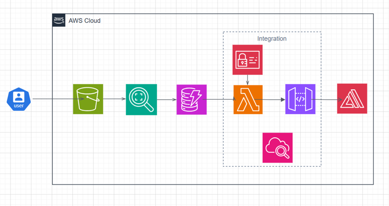

# Automatic License Plate Recognition System

> **A serverless AWS-based web application for automatic license plate
> recognition using Amazon Rekognition, S3, Lambda, API Gateway,
> DynamoDB, and Amplify.**

[](https://aws.amazon.com/)
[](https://www.python.org/)
[](https://aws.amazon.com/s3/)
[](https://aws.amazon.com/lambda/)
[](https://aws.amazon.com/dynamodb/)
[](https://aws.amazon.com/rekognition/)
[](https://aws.amazon.com/amplify/)

------------------------------------------------------------------------

## Overview

The **Automatic License Plate Recognition (ALPR) System** is a
cloud-native web application that automatically extracts license plate
information from vehicle images.

The application uses AWS managed and serverless services to create an
end-to-end pipeline:

**Upload Image → Store in S3 → Process with Rekognition → Store Results
in DynamoDB → Display Results**

The architecture minimizes infrastructure management while providing a
scalable foundation for image-based recognition workloads.

Watch the project demonstration:

**[▶️ Automatic License Plate Recognition System --- YouTube
Demo](https://youtu.be/Bh6bCZ0DPmw)**

------------------------------------------------------------------------

## System Architecture



-----------------------------------------------------------------------

## Architecture Data Flow

### 1. Image Upload

The user uploads a vehicle image through the web interface hosted on
**AWS Amplify**.

### 2. API Request

The frontend sends the request to an **Amazon API Gateway** REST
endpoint.

### 3. Lambda Processing

**AWS Lambda** receives the request and orchestrates the backend
processing workflow.

### 4. Image Storage

The uploaded image is stored in an **Amazon S3 bucket**.

### 5. License Plate Recognition

The Lambda function invokes **Amazon Rekognition** to analyze the image
and extract the license plate information.

### 6. Result Persistence

Detected plate information and associated metadata are stored in
**Amazon DynamoDB**.

### 7. Response

The processed result is returned through **API Gateway** to the
frontend.

### 8. Monitoring

**Amazon CloudWatch** captures Lambda execution logs and operational
information for debugging and monitoring.

------------------------------------------------------------------------

## AWS Services Used

  -----------------------------------------------------------------------
  AWS Service                         Role in the Project
  ----------------------------------- -----------------------------------
  **AWS Amplify**                     Hosts and serves the frontend
                                      application

  **Amazon API Gateway**              Provides REST API endpoints

  **AWS Lambda**                      Executes serverless backend logic

  **Amazon S3**                       Stores uploaded vehicle images

  **Amazon Rekognition**              Performs image analysis and license
                                      plate recognition

  **Amazon DynamoDB**                 Stores detected plate data and
                                      timestamps

  **AWS IAM**                         Controls permissions between AWS
                                      services

  **Amazon CloudWatch**               Provides logs and operational
                                      monitoring
  -----------------------------------------------------------------------

------------------------------------------------------------------------

# Setup & Deployment

## Prerequisites

Before deployment, make sure you have:

-   An active **AWS account**
-   An AWS IAM user/role with sufficient permissions
-   A GitHub repository containing the project
-   Python 3.x for Lambda development
-   An AWS region selected for deployment

------------------------------------------------------------------------

## 1. Create the Amazon S3 Bucket

Create an S3 bucket to store uploaded vehicle images.

Example:

``` text
license-plate-storage-bucket
```

Configure CORS if the frontend needs direct browser-based interaction
with the bucket.

### Recommended considerations

-   Keep the bucket private unless public access is explicitly required.
-   Use IAM policies instead of broad public permissions.
-   Enable encryption at rest.
-   Consider lifecycle rules for automatically managing old uploads.

------------------------------------------------------------------------

## 2. Create the DynamoDB Table

Create a DynamoDB table named:

``` text
LicensePlates
```

Use:

``` text
Primary Key: id
Type: String
```

A stored record can contain information such as:

``` json
{
  "id": "unique-record-id",
  "licensePlate": "ABC1234",
  "timestamp": "2026-01-01T12:00:00Z"
}
```

> The exact attributes should match the implementation in
> `backend/lambda_function.py`.

------------------------------------------------------------------------

## 3. Configure IAM

Create an IAM role for the Lambda function.

The role should provide only the permissions required by the
application.

For a coursework/demo environment, the original implementation uses:

-   `AmazonS3FullAccess`
-   `AmazonRekognitionFullAccess`
-   `AmazonDynamoDBFullAccess`
-   `AWSLambdaBasicExecutionRole`

### Security Recommendation

For production deployments, replace broad managed policies such as
`FullAccess` with **least-privilege custom policies** that allow only
the required actions on the specific S3 bucket, DynamoDB table, and
Rekognition operations.

------------------------------------------------------------------------

## 4. Deploy AWS Lambda

Create a Lambda function using:

``` text
Runtime: Python 3.x
```

Upload the backend implementation:

``` text
backend/lambda_function.py
```

Configure the following environment variables:

``` text
S3_BUCKET_NAME=<your-bucket-name>
DYNAMODB_TABLE=LicensePlates
```

The Lambda function is responsible for coordinating:

``` text
API Request
    ↓
S3 Image
    ↓
Amazon Rekognition
    ↓
DynamoDB
    ↓
API Response
```

------------------------------------------------------------------------

## 5. Configure API Gateway

Create an **API Gateway REST API**.

Configure a `POST` endpoint connected to the Lambda function.

Example:

``` text
POST /recognize
```

Enable CORS so that the frontend can communicate with the API.

Deploy the API to a stage such as:

``` text
prod
```

The resulting API endpoint should then be configured in the frontend.

------------------------------------------------------------------------

## 6. Deploy with AWS Amplify

Connect the GitHub repository to **AWS Amplify**.

Configure the application so that the frontend is served from:

``` text
frontend/
```

After the build configuration is complete:

1.  Connect the GitHub repository.
2.  Select the required branch.
3.  Configure the frontend build settings.
4.  Set the API endpoint used by the frontend.
5.  Deploy the application.
6.  Open the generated Amplify URL.

------------------------------------------------------------------------

# Testing the Application

A typical test flow is:

``` text
1. Open the deployed web application
        ↓
2. Upload a vehicle image
        ↓
3. Submit the image
        ↓
4. API Gateway receives the request
        ↓
5. Lambda processes the request
        ↓
6. Image is accessed from S3
        ↓
7. Rekognition analyzes the image
        ↓
8. License plate result is generated
        ↓
9. Result is stored in DynamoDB
        ↓
10. Result is displayed to the user
```

### Example Test Cases

  ------------------------------------------------------------------------
  Test Case               Input                    Expected Result
  ----------------------- ------------------------ -----------------------
  Valid vehicle image     Clear vehicle image      License plate
                                                   information detected

  Multiple vehicle image  Image containing         Recognition depends on
                          multiple vehicles        Rekognition response

  Low-quality image       Blurred/low-resolution   Recognition may be
                          image                    inaccurate or
                                                   unavailable

  Invalid file            Unsupported/non-image    Request should be
                          file                     rejected or handled
                                                   gracefully

  Empty upload            No image                 Frontend should prevent
                                                   submission
  ------------------------------------------------------------------------

------------------------------------------------------------------------

# Data & Storage

The system separates image storage from recognition metadata.

### Amazon S3

Stores:

``` text
Vehicle Images
```

### Amazon DynamoDB

Stores:

``` text
License Plate Result
Record ID
Timestamp
Additional Metadata
```

This separation allows the application to keep object storage and
structured application data independently managed.

------------------------------------------------------------------------

```{=html}
<p align="center">
```
Built with AWS
```{=html}
</p>
```
